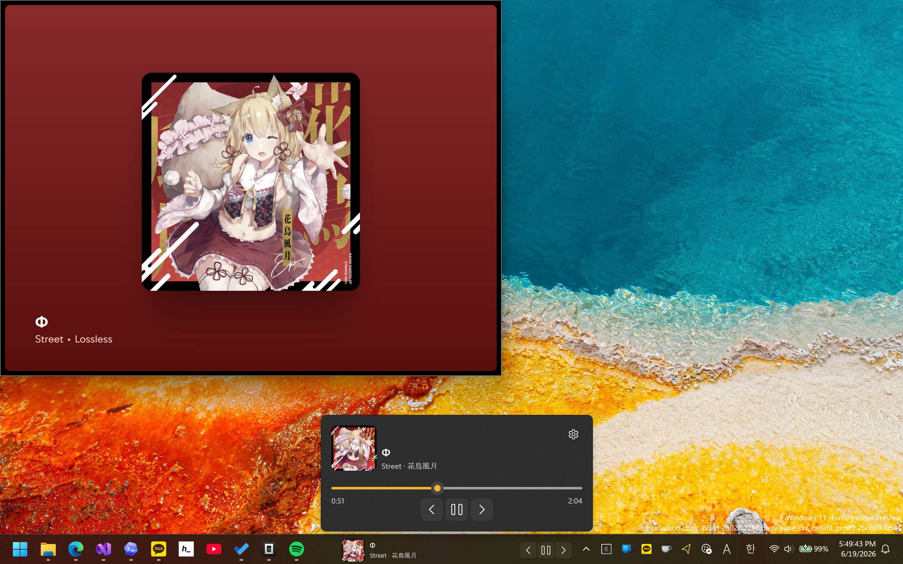

# BarPlay

🌐 [English](README.md)

BarPlay는 미디어 재생 정보와 제어 버튼을 Windows 11 작업 표시줄에 직접 띄워주는 가벼운 위젯 앱입니다.
작업 표시줄에 자연스럽게 녹아들어, 다른 창으로 전환할 필요 없이 현재 재생 중인 미디어를 확인하고 제어할 수 있습니다.

## 주요 기능

- Windows 11 작업 표시줄에 표시되는 위젯으로 완벽하게 통합
- 현재 재생 중인 미디어의 썸네일, 제목, 설명을 한눈에 표시
- 이전 곡, 재생/일시정지, 다음 곡 등 미디어 제어 버튼 제공
- 위젯을 클릭하여 확장되는 메뉴에서 스크러빙 슬라이더 지원
- Windows 시스템 미디어 전송 제어(GSMTC)를 지원하는 모든 앱과 연동 (Spotify, 웹 브라우저, YouTube 등)
- 시스템 시작 시 자동 실행 지원
- NativeAOT 컴파일을 적용하여 매우 빠른 시작 속도와 최소한의 리소스만 사용
- 다국어 UI 지원 (영어, 한국어, 일본어, 중국어 간체, 중국어 번체)

## 사용 라이브러리

- [Microsoft.WindowsAppSDK](https://github.com/microsoft/WindowsAppSDK) - WinUI 3 앱 플랫폼과 Windows 통합 기능
- [Deskband11Lib](https://github.com/StartIsBack/Deskband11Lib) - Windows 11 작업 표시줄 위젯 통합
- [CommunityToolkit.Mvvm](https://github.com/CommunityToolkit/dotnet) - MVVM 아키텍처 및 소스 생성기
- [Microsoft.Extensions.DependencyInjection](https://github.com/dotnet/runtime) - 종속성 주입(DI) 컨테이너

## 라이선스

이 프로젝트는 [MIT 라이선스](LICENSE.txt)로 배포됩니다.

## 작성자

**이호원** ([airtaxi](https://github.com/airtaxi))
